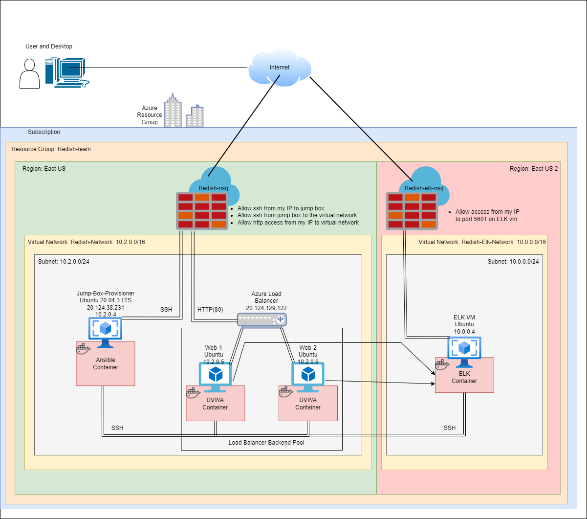

<<<<<<< HEAD
## Automated ELK Stack Deployment

The files in this repository were used to configure the network depicted below.

These files have been tested and used to generate a live ELK deployment on Azure. They can be used to either recreate the entire deployment pictured above. Alternatively, select portions of the ansible file may be used to install only certain pieces of it, such as Filebeat.

- [Ansible](https://github.com/Silvenore/Fundamentals/tree/main/Ansible)

This document contains the following details:
- Description of the Topology
- Access Policies
- ELK Configuration
  - Beats in Use
  - Machines Being Monitored
- How to Use the Ansible Build

### Description of the Topology

The main purpose of this network is to expose a load-balanced and monitored instance of DVWA, the D*mn Vulnerable Web Application.

Load balancing ensures that the application will be highly redundant, in addition to restricting access to the network.

Integrating an ELK server allows users to easily monitor the vulnerable VMs for changes to the files and system metrics.

The configuration details of each machine may be found below.

| Name     | Function | IP Address | Operating System |
|----------|----------|------------|------------------|
| Jump Box | Gateway  | 10.2.0.4   | Linux            |
| Web-1    | DVWA     | 10.2.0.5   | Linux            |
| Web-2    | DVWA     | 10.2.0.6   | Linux            |
| Elk      | Monitor  | 10.0.0.4   | Linux            |

### Access Policies

The machines on the internal network are not exposed to the public Internet. 

Only the Jump Box machine can accept connections from the Internet. Access to this machine is only allowed from the following IP addresses:
- 71.85.211.91

Machines within the network can only be accessed by 10.2.0.4 which is the Jump Box.

A summary of the access policies in place can be found in the table below.

| Name     | Publicly Accessible | Allowed IP Addresses |
|----------|---------------------|----------------------|
| Jump Box | Yes                 | 71.85.211.91         |
| Web-1    | No                  | 10.2.0.5             |
| Web-2    | No                  | 10.2.0.5             |
| Elk      | No                  | 10.2.0.5             |

### Elk Configuration

Ansible was used to automate configuration of the ELK machine. No configuration was performed manually, which is advantageous because it simplifies the installation process and allows us to easily see which ports are open.  

The playbook implements the following tasks:
- Set vm.max_map_count to 262144
- Install docker.io
- Install python3-pip
- Install docker using pip
- Downloads the elk image and starts it
- Enable docker on system start

The following screenshot displays the result of running `docker ps` after successfully configuring the ELK instance.

### Target Machines & Beats
This ELK server is configured to monitor the following machines:
- 10.2.0.5
- 10.2.0.6

We have installed the following Beats on these machines:
- Filebeat
- Metricbeat

These Beats allow us to collect the following information from each machine:
- Filebeat collects data about the file system. It collects information from users connecting to the web servers and how they are interacting with it.
- Metricbeat collects data about the health of a system. It collects CPU usage of a machine to see how much load is being put on a machine. 

### Using the Playbook
In order to use the playbook, you will need to have an Ansible control node already configured. Assuming you have such a control node provisioned: 

SSH into the control node and follow the steps below:
- Copy the Ansible/install-elk.yaml file to /etc/ansible.
- Update the hosts file to include (your_vm_ip) ansible_python_interpreter=/usr/bin/python3 in the elk group.
- Run the playbook, and navigate to http://[your.ELK-VM.External.IP]:5601/app/kibana to check that the installation worked as expected.
